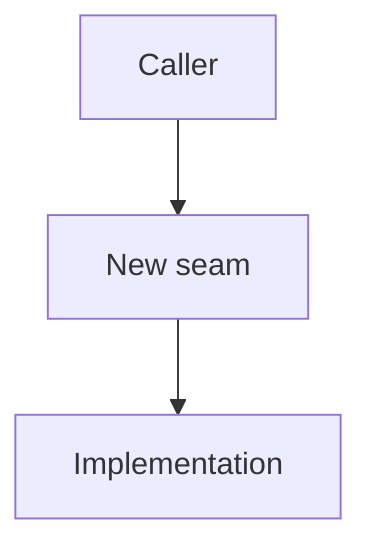

# Writing a spec

## Purpose

A spec is the feature's architectural north star. It creates enough durable
clarity for humans and agents to build reviewable slices without re-litigating
the big picture.

A spec is **not** the full implementation design and **not** an implementation
checklist.

Core rule:

> Specs set architectural intent. Slices discover implementation detail.

## What belongs in the spec

Include only durable context that should guide many slices:

- problem and why it matters
- target architecture / solution shape
- glossary for terms that are easy to confuse
- important pieces and responsibilities
- public API direction or caller contracts
- major constraints and non-goals
- important architectural decisions
- review strategy / likely slice boundaries
- high-level validation expectations
- open questions that genuinely affect direction

## What does not belong

Leave these for local grilling during build slices:

- every edge case
- every test case
- every file to edit
- every hook payload detail
- every internal helper shape
- every sequencing step
- speculative implementation details

If a detail affects public API, architecture, or review strategy, include it.
Otherwise decide it during the relevant slice.

## Brevity rules

Default to short. The spec should be readable in one sitting without feeling
like a documentation chore.

Hard limits unless the user explicitly asks for more:

- small change: ~20 lines
- medium feature: ~60 lines
- large/risky feature: ~120 lines

If the spec wants to exceed the limit, stop and ask what to compress. Do not
solve length by creating appendices or extra docs by default.

Prefer:

- bullets over paragraphs
- one representative example over many examples
- grouped acceptance criteria over exhaustive test lists
- named responsibilities over full file inventories
- links/references over copied context

Avoid:

- long historical explanations
- exhaustive edge-case dumps
- full file trees unless essential
- multiple code examples for the same idea
- documenting details that can be discovered during the slice

Long specs are a smell when they force reviewers to review an imaginary full
implementation instead of the architectural direction.

## Structure

This is a menu, not a template. Omit aggressively.

```md
# Spec: <name>

<One sentence: what changes, why it matters, how it behaves, and where it likely lives.>

## Problem

<The current problem and why it matters.>

## Target architecture

<The intended shape of the solution. Include a diagram when it makes the shape easier to review. 
This is a very important section. Used advanced mermaid diagram to render the core services and abstractions of the solution.>



## Glossary

Include only terms that are easy to confuse.

| Term | Meaning | Avoid |
|------|---------|-------|
| ... | ... | ... |

## Important pieces

- `<piece>` — responsibility and why it matters

## Public API direction

```ts
// Include only stable caller-facing shape or important contract direction.
```

## Relevant types / interfaces

Use a table when more than two items matter.

| Type / interface | Role | Important contract |
|------------------|------|--------------------|
| `TypeName` | What it represents | Invariants, caller expectations, or error modes |
| `functionName()` | What callers use it for | Inputs, outputs, ordering, or failure behavior |

## Architecture decisions

- <Decision and why.>

## Acceptance criteria

High-level criteria only. Detailed cases belong to slice tests.

- [ ] Should ... `[unit|integration|smoke]`
- [ ] Should not ... `[unit|integration|smoke]`

## Out of scope

- ...

## Open questions

- ...

Omit sections that do not help. If a section is interesting but not needed for
review, delete it.

Before finalizing, compress the spec:

- remove repeated ideas
- collapse detailed examples into one representative example
- group related criteria
- move implementation details back to local slice grilling
- keep only durable architecture/API/glossary decisions

## Acceptance criteria

Acceptance criteria are high-level review anchors, not an exhaustive test plan.
Prefer behavior wording:

- `Should ...`
- `Should not ...`
- `Should reject ...`

Detailed edge cases should be discovered and validated inside the relevant build
slice. Do not put a full test matrix in the spec unless explicitly requested.

## Updating the spec during build

Update the spec only when a slice changes durable direction:

- target architecture changes
- public API/caller contract changes
- glossary term is clarified
- major constraint or non-goal changes

Do not update the spec for ordinary implementation details that belong in code,
tests, commits, or PR descriptions.
